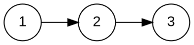

# Linked List Diagrams

To generate linked list diagrams that look neat and consistent every time, you can use GraphViz with the DOT language. Head over to [this website](https://is.gd/nTPRmK) which contains the following template in the editor pane:



To edit the linked list contents, edit the line containing `1 -> 2 -> 3;` to whatever you'd like you linked list to display. The node names can be any string, but must be enclosed in quotes if they contain spaces. In between each node name should be an arrow.

To make the arrows between the nodes have arrowheads on both ends (to represent a doubly linked list) add the following line below the `node` line:

```dot
edge [dir = "both"];
```

Export the image by changing the drop down in the viewing pane to "png" and click Download.

Inside the question folder, create a new folder called `clientFilesQuestion` if it does not already exist. Place the image into `clientFilesQuestion`, and insert this template into `question.html`, replacing `imagename.png` with the name of the image file:

```html
<pl-figure file-name="imagename.png" inline="true"></pl-figure>
```

The official documentation for GraphViz can be found [here](https://graphviz.org/documentation/), and the offical documentation for this question element can be found [here](https://prairielearn.readthedocs.io/en/latest/elements/#pl-figure-element).